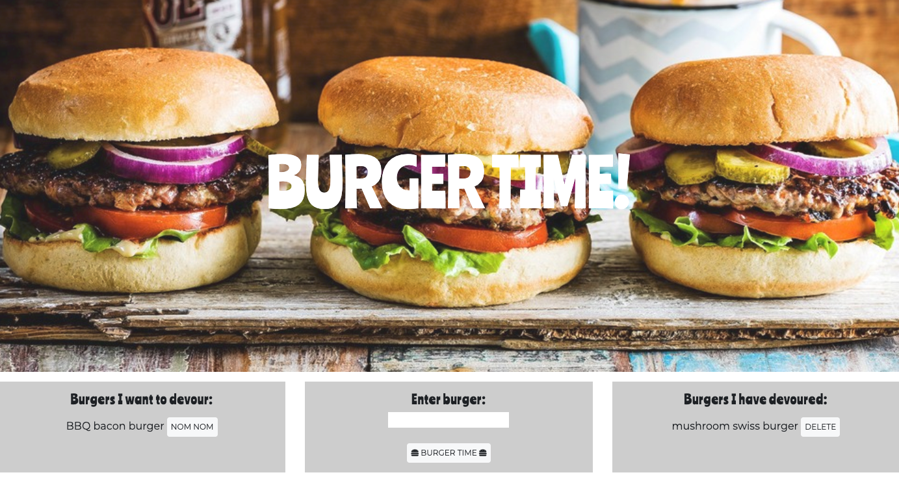

# Burgers!

### Overview

Burgers! is an app that lets users input the names of burgers they'd like to eat as well as mark them as 'devoured' once they have eaten them. This application is created with MySQL, Node, Express, Handlebars and a homemade ORM and follows the MVC design pattern.

### User Story

As a burger-connoisseur
I WANT a web application that I can log the burgers I would like to eat
SO THAT I can keep track of when I have eaten them

### Example

